# Exemplos dos formatos

Ilustrações próprias de três estados da edição. Não são prints de vídeos executados ou aprovados. As cores e fontes de cada trabalho vêm da ID escolhida; estas imagens não criam uma ID padrão.

Todo o conteúdo deste diretório foi criado para demonstração e pode ser redistribuído com a fábrica. Não contém imagens ou dados de clientes. Os PNGs estão prontos para leitura; os SVGs são as versões editáveis.

## F01 — Chat

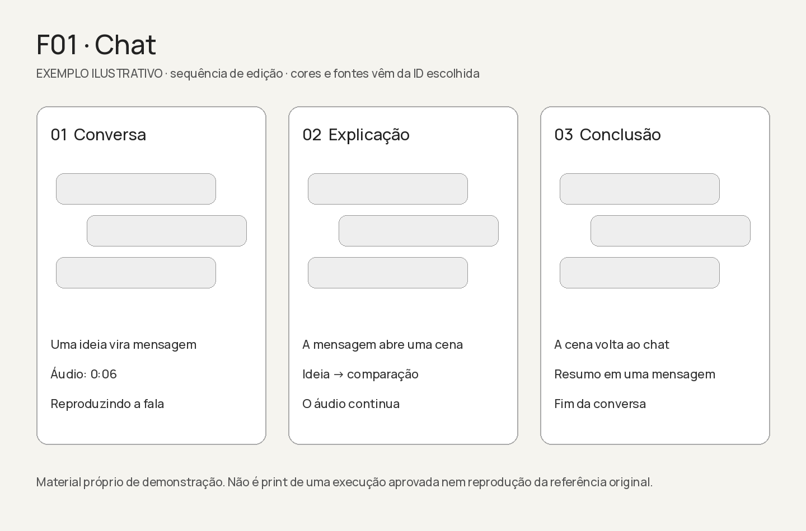

[SVG editável](F01.svg)

## F02 — Dinâmico

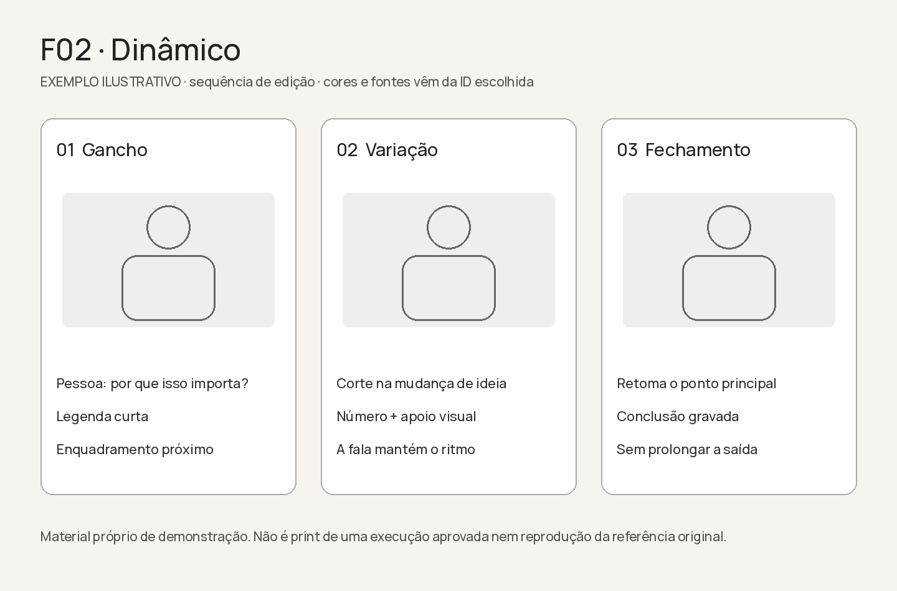

[SVG editável](F02.svg)

## F03 — Foto Falante

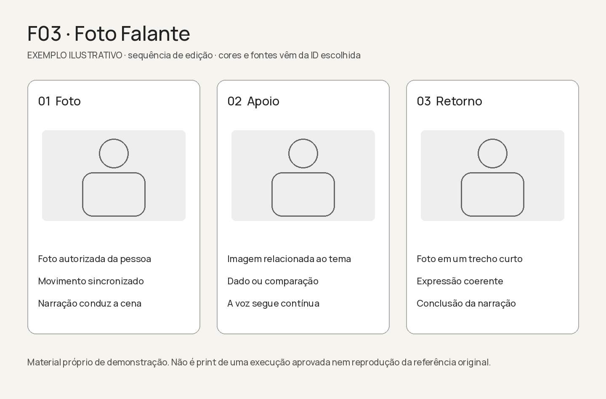

[SVG editável](F03.svg)

## F04 — Gancho e Animação

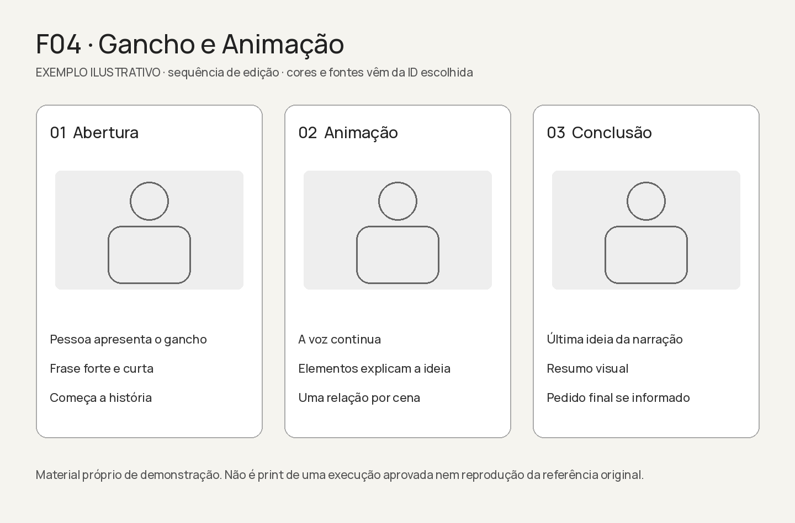

[SVG editável](F04.svg)

## F05 — Editorial

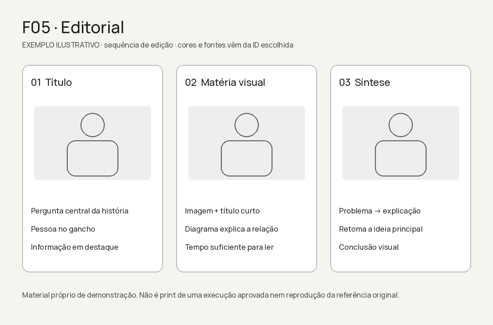

[SVG editável](F05.svg)

## F06 — Diagramas

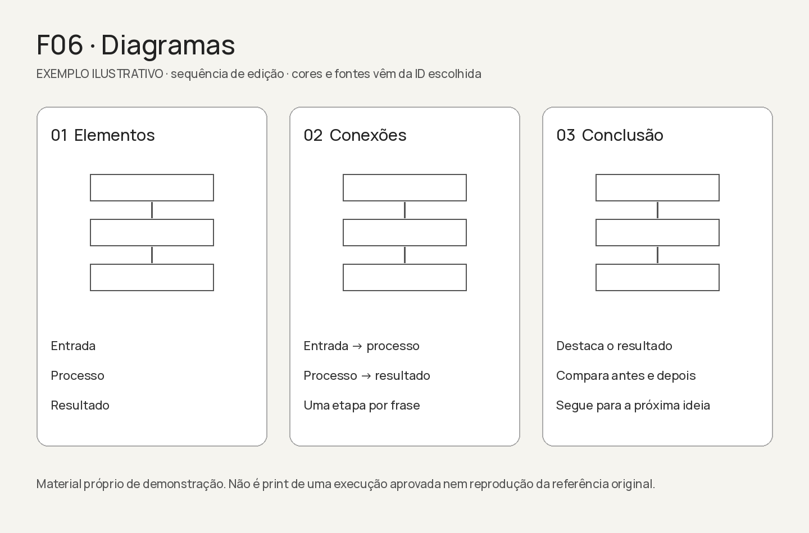

[SVG editável](F06.svg)

## F07 — Tela Animada

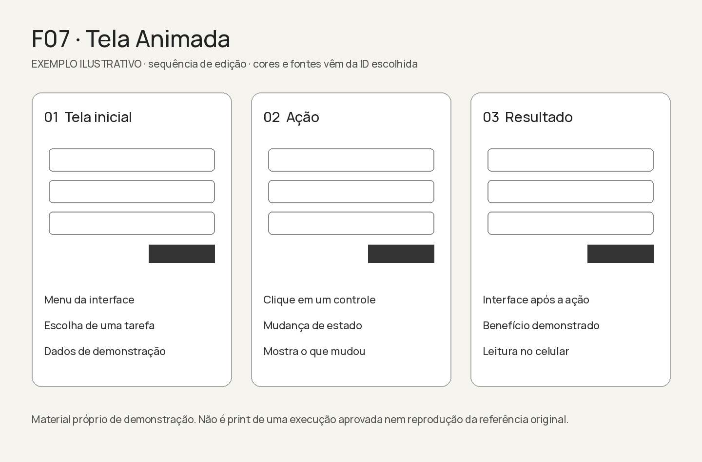

[SVG editável](F07.svg)

## F08 — Camadas

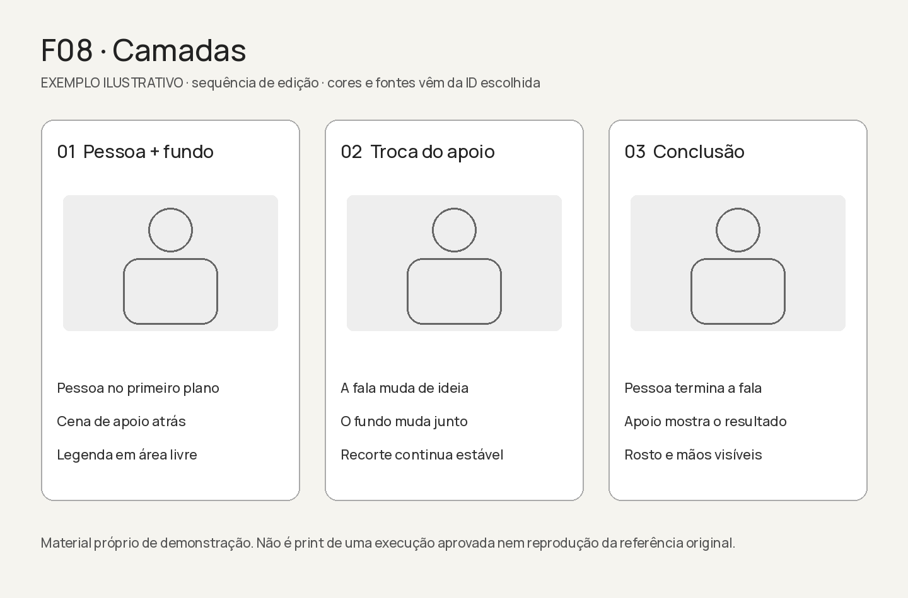

[SVG editável](F08.svg)

## F09 — Conversa e Tela

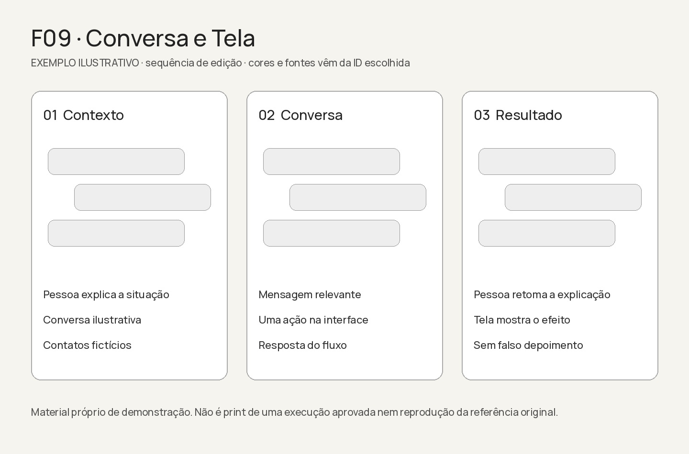

[SVG editável](F09.svg)

## F10 — Pessoa e Tela

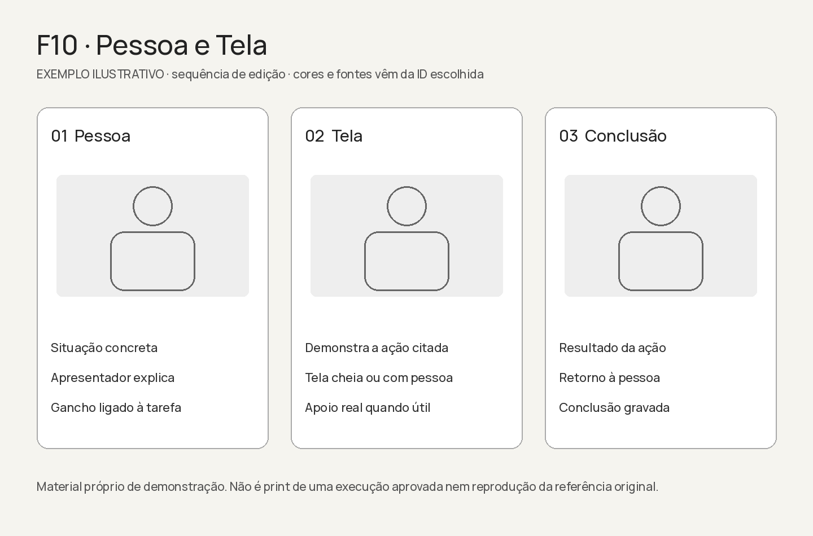

[SVG editável](F10.svg)

## F11 — Formulários

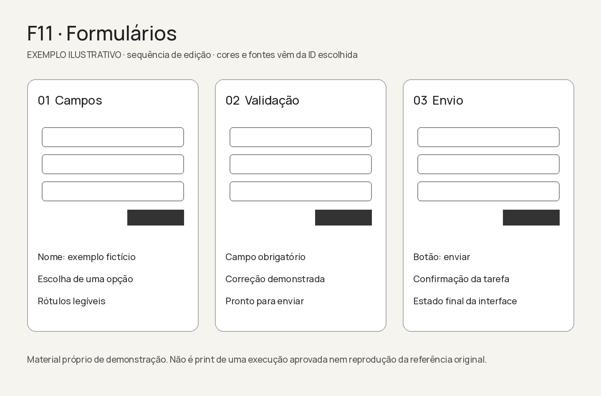

[SVG editável](F11.svg)

## F12 — Documentário

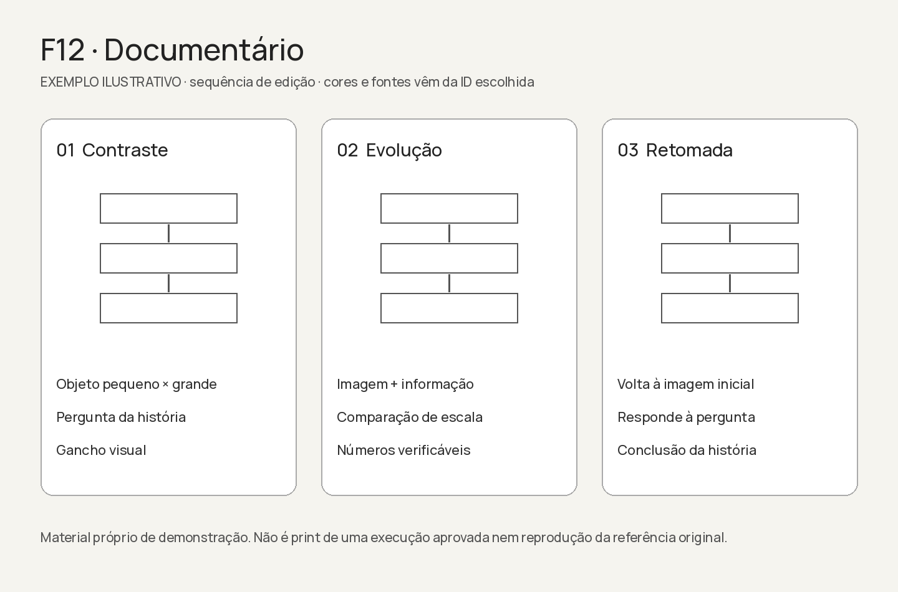

[SVG editável](F12.svg)
